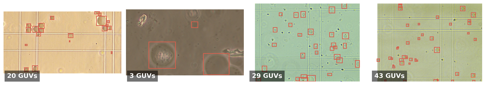
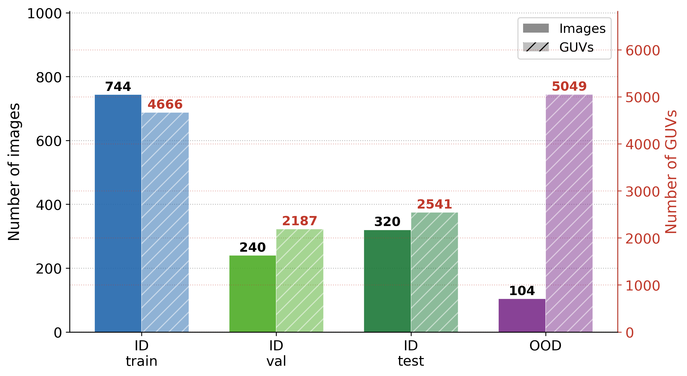
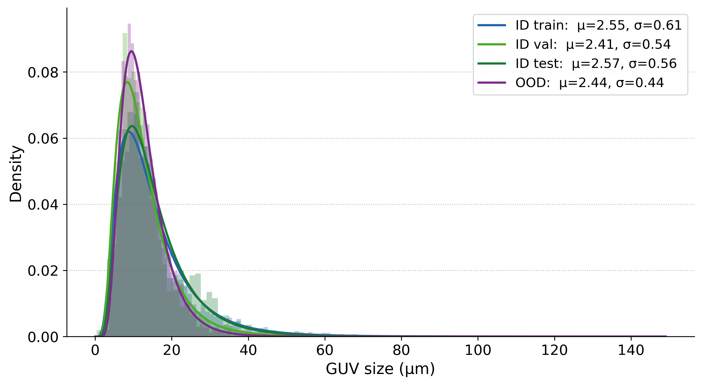

# GUV Detection Dataset

Annotated microscopy dataset for **Giant Unilamellar Vesicle (GUV)** detection using bounding box annotations in YOLO format. The dataset covers two microscope sources, two magnification levels, and is partitioned into training, validation, test, and cross-microscope generalization splits.

---

## Contents

- [GUV Detection Dataset](#guv-detection-dataset)
  - [Contents](#contents)
  - [Background](#background)
  - [Dataset Overview](#dataset-overview)
  - [Acquisition Protocol](#acquisition-protocol)
  - [Tiling Strategy](#tiling-strategy)
    - [Tile naming suffixes](#tile-naming-suffixes)
  - [Dataset Splits](#dataset-splits)
  - [Annotation Format](#annotation-format)
  - [File Naming Convention](#file-naming-convention)
    - [Nikon (high magnification)](#nikon-high-magnification)
    - [Nikon (low magnification)](#nikon-low-magnification)
    - [Leica](#leica)
  - [Directory Structure](#directory-structure)
  - [Dataset Statistics](#dataset-statistics)
    - [Detailed breakdown](#detailed-breakdown)
    - [Summary by split](#summary-by-split)
    - [GUV size distribution](#guv-size-distribution)
  - [License](#license)

---

## Background

Giant Unilamellar Vesicles (GUVs) are cell-sized lipid membrane structures widely used as model systems in biophysics and synthetic biology. Automated detection of GUVs in phase-contrast microscopy images is a prerequisite for high-throughput analysis of vesicle populations. This dataset provides labeled images for training and evaluating object detection models for this task.

GUVs were produced by the **droplet transfer method**, a centrifugation-based emulsion technique that enables efficient encapsulation of water-soluble components without the need for specialized microfluidic equipment. The resulting vesicle suspensions were deposited onto glass-bottom chambers prior to imaging.

---

## Dataset Overview

| Property | Value |
|---|---|
| Task | Object detection (bounding boxes) |
| Annotation format | YOLO (normalized `class cx cy w h`) |
| Number of classes | 1 (GUV) |
| Microscope sources | Nikon, Leica |
| Modalities | RGB, Grayscale |
| Total annotated images | 1208 |
| Total annotated GUVs | 14,544 |



---

## Acquisition Protocol

Phase-contrast microscopy images were acquired using two optical systems:

- **Nikon [MODEL]** — used for the main training/validation/test dataset
- **Leica [MODEL]** — used exclusively for cross-microscope generalization evaluation

The spatial calibration factors (µm/pixel) for each system are:

| Microscope | Magnification | µm/pixel |
|---|---|---|
| Nikon | High | **0.120** |
| Nikon | Low | **0.339** |
| Leica | — | **0.45** |

Physical grids were overlaid on the samples during acquisition to facilitate systematic traversal of the field of view. Images were saved in RGB format. Acquisitions were performed at two magnification levels on the Nikon system, resulting in different native resolutions (see [Tiling Strategy](#tiling-strategy)).

Each full-resolution acquisition was manually annotated by expert researchers using bounding boxes enclosing every visible GUV. Annotations were produced using [Label Studio](https://labelstud.io/), an open-source annotation platform.

---

## Tiling Strategy

Full-resolution acquisitions were divided into non-overlapping sub-images (tiles) to reduce memory footprint and bring GUV-scale objects into a resolution range suitable for detection models. The tiling grid depended on the magnification used:

| Microscope | Magnification | Original resolution (px) | Grid | Tile size (px) | Tiles / acquisition |
|---|---|---|---|---|---|
| Nikon | High | 3264 × 1840 | 2 × 2 | 1632 × 920 | 4 |
| Nikon | Low | 4096 × 2168 | 4 × 4 | 1024 × 542 | up to 16 |
| Leica | — | 1920 × 1440 | 2 × 2 | 960 × 720 | up to 4 |

> Some acquisitions have fewer tiles than the maximum if border tiles were discarded (e.g., out-of-focus regions or insufficient sample coverage).

All tiles are subsequently rescaled to **640 × 640 pixels** when used as input to YOLOv11-based detection models. Bounding box coordinates in the label files refer to the tile coordinate system (before rescaling).

### Tile naming suffixes

High-magnification Nikon and Leica tiles use quadrant suffixes:

| Suffix | Position |
|---|---|
| `_tl` | top-left |
| `_tr` | top-right |
| `_bl` | bottom-left |
| `_br` | bottom-right |

Low-magnification Nikon tiles use a row-column grid notation:

| Suffix | Position |
|---|---|
| `_A1` … `_A4` | top row, columns 1–4 |
| `_B1` … `_B4` | second row, columns 1–4 |
| `_C1` … `_C4` | third row, columns 1–4 |
| `_D1` … `_D4` | bottom row, columns 1–4 |

---

## Dataset Splits

Partitioning was performed at the **acquisition level** to prevent data leakage between splits (tiles from the same acquisition are never split across train and val/test).

| Split | Purpose |
|---|---|
| `train` | Model training (Nikon only) |
| `val` | Hyperparameter tuning and model selection (Nikon only) |
| `test` | Final held-out evaluation (Nikon only) |
| `*_Leica_1`, `*_Leica_2` | Cross-microscope generalization (Leica only) |

---

## Annotation Format

Annotations follow the **YOLO format**: one `.txt` file per image, located in the `labels/` subfolder alongside `images/`. Each line in a label file describes one bounding box:

```
<class_id> <cx> <cy> <w> <h>
```

All values are normalized to `[0, 1]` relative to the tile dimensions. There is a single class:

| Class ID | Label |
|---|---|
| 0 | GUV |

Empty label files (no annotations) are present for tiles containing no visible GUVs.

---

## File Naming Convention

### Nikon (high magnification)
```
<experiment_id>-<image_id>_<quadrant>.jpg
```
Example: `GR01_20230406_NIK_P05_E012_01_ER_01-IMG03091_bl.jpg`

| Field | Example | Description |
|---|---|---|
| experiment_id | `GR01_20230406_NIK_P05_E012_01_ER_01` | Experiment metadata |
| image_id | `IMG03091` | Sequential acquisition index |
| quadrant | `bl` | Tile position (tl/tr/bl/br) |

### Nikon (low magnification)
```
<experiment_id>_<row><col>.jpg
```
Example: `GR06_20240506_NIK_P17_E022_01_01_B3.jpg`

| Field | Example | Description |
|---|---|---|
| experiment_id | `GR06_20240506_NIK_P17_E022_01_01` | Experiment metadata |
| row | `B` | Grid row (A–D) |
| col | `3` | Grid column (1–4) |

### Leica
```
<uuid>-<experiment_id>_<quadrant>.jpg
```
Example: `23abc247-20250708_LEI_P06_E112_01_FL_02_01_bl.jpg`

| Field | Example | Description |
|---|---|---|
| uuid | `23abc247` | Unique acquisition identifier |
| experiment_id | `20250708_LEI_P06_E112_01_FL_02_01` | Experiment metadata |
| quadrant | `bl` | Tile position (tl/tr/bl/br) |

---

## Directory Structure

```
GUV_dataset/
├── rgb/
│   ├── train/
│   │   ├── images/          # Tile images (.jpg)
│   │   ├── labels/          # YOLO annotations (.txt)
│   │   └── labels.cache     # YOLO cache file
│   ├── val/
│   │   ├── images/
│   │   ├── labels/
│   │   └── labels.cache
│   ├── test/
│   │   ├── images/
│   │   ├── labels/
│   │   └── labels.cache
│   ├── train_Leica_1/
│   │   ├── images/
│   │   ├── labels/
│   │   └── labels.cache
│   ├── val_Leica_1/
│   │   ├── images/
│   │   ├── labels/
│   │   └── labels.cache
│   ├── train_Leica_2/
│   │   ├── images/
│   │   ├── labels/
│   │   └── labels.cache
│   └── val_Leica_2/
│       ├── images/
│       ├── labels/
│       └── labels.cache
├── grey_scale/              # Grayscale versions (structure mirrors rgb/)
├── README.md
└── LICENSE
```

---

## Dataset Statistics

### Detailed breakdown

| Microscope | Magnification | Original res. (px) | Tile size (px) | Tiling | Split | Acquisitions | Images | GUVs |
|---|---|---|---|---|---|---|---|---|
| Nikon | High | 3264 × 1840 | 1632 × 920 | 2×2 | Training | 154 | 616 | 2284 |
| Nikon | Low | 4096 × 2168 | 1024 × 542 | 4×4 | Training | 10 | 128 | 2382 |
| Nikon | High | 3264 × 1840 | 1632 × 920 | 2×2 | Validation | 52 | 208 | 1600 |
| Nikon | Low | 4096 × 2168 | 1024 × 542 | 4×4 | Validation | 3 | 32 | 587 |
| Nikon | High | 3264 × 1840 | 1632 × 920 | 2×2 | Test | 40 | 160 | 823 |
| Nikon | Low | 4096 × 2168 | 1024 × 542 | 4×4 | Test | 10 | 160 | 1718 |
| Leica | — | 1920 × 1440 | 960 × 720 | 2×2 | Generalization | 26 | 104 | 5049 |
| **Total** | | | | | | **295** | **1408** | **14,443** |

### Summary by split

| Split | Acquisitions | Images | GUVs |
|---|---|---|---|
| Training (Nikon) | 164 | 744 | 4666 |
| Validation (Nikon) | 55 | 240 | 2187 |
| Test (Nikon) | 50 | 320 | 2541 |
| Generalization (Leica) | 26 | 104 | 5049 |
| **Total** | **295** | **1408** | **14,443** |



### GUV size distribution

GUV bounding-box sizes (in µm) follow a right-skewed distribution, with most vesicles in the 2–10 µm range. The Leica split shows a narrower spread due to its higher µm/pixel calibration factor.



---

## License

See [LICENSE](LICENSE).
